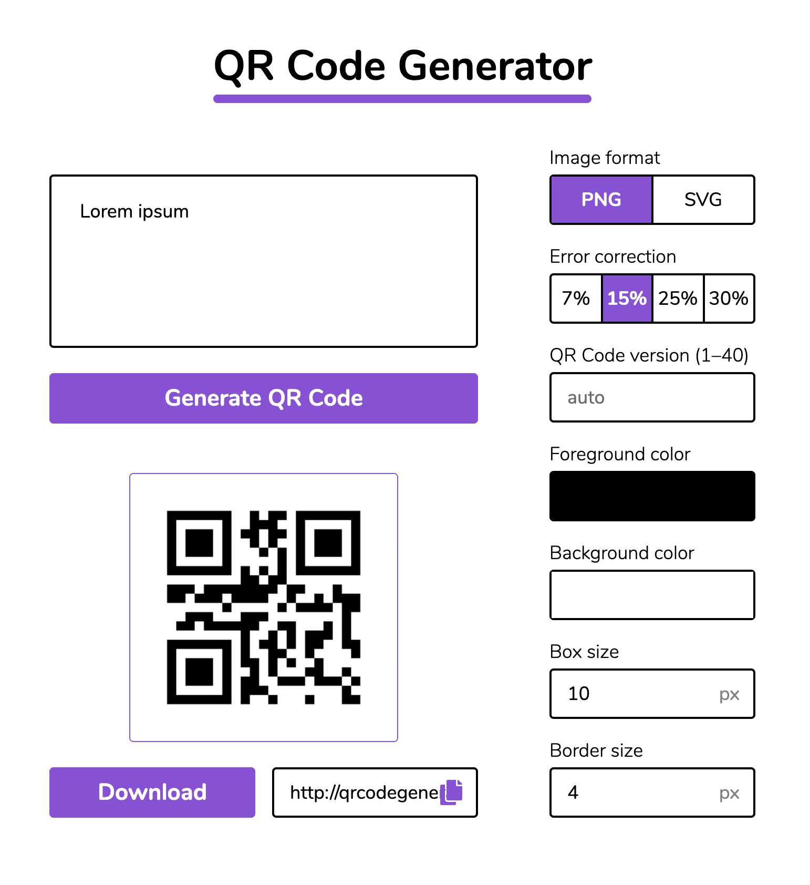
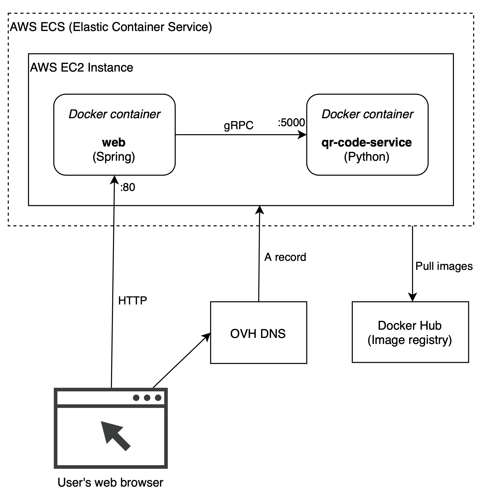

# QR Code Generator

### Demo

**[qrcodegenerator.piotrjanczyk.com](http://qrcodegenerator.piotrjanczyk.com/)**



### Architecture



### UI Design

**[Figma](https://www.figma.com/file/m0zkjHTBtYOHYB327GsUou/QR_Code_Generator?node-id=0%3A1)**

### Local development

All services can be run with Docker Compose:

```bash
docker-compose up --build
```

### Deployment

See [`deploy.sh`](deploy.sh) script.

It builds and deploys to [qrcodegenerator.piotrjanczyk.com](http://qrcodegenerator.piotrjanczyk.com/):
* Builds Docker images
* Pushes them to Docker Hub
* Deploys them to AWS ECS
